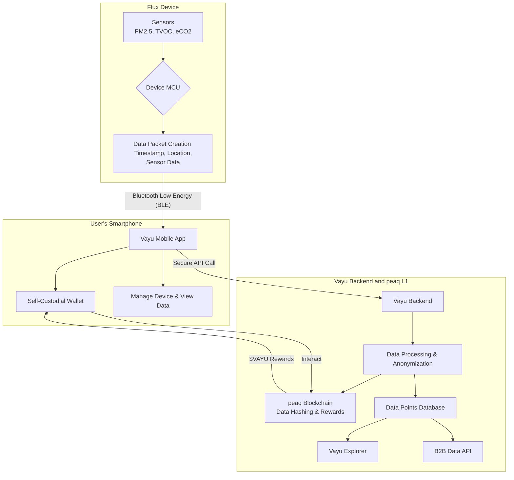

# Architecture Overview

**A High-Level Look at the Vayu.network Ecosystem**

The Vayu.network architecture is designed as a robust, scalable, and secure system for collecting, processing, and utilizing indoor air quality data. The ecosystem consists of three main components: the Flux Hardware, the Vayu Mobile App, and the Vayu Backend Infrastructure, which is built on the peaq network.

## Data Flow Diagram

## Component Breakdown

1.  **Flux Device:** This is the primary data collection tool.
    *   **Sensors:** Equipped with high-precision sensors (Plantower for PM, Renesas for TVOC/eCO2) to measure key air quality indicators.
    *   **MCU (Microcontroller Unit):** The onboard processor reads the raw data from the sensors, packages it with a timestamp and location data, and prepares it for secure transmission.

2.  **Vayu Mobile App:** The user's gateway to the network.
    *   **BLE Connection:** The app connects seamlessly to the Flux device via Bluetooth Low Energy to receive the data packets.
    *   **Data Relay:** It securely forwards the anonymized data to the Vayu backend.
    *   **User Interface:** Allows users to view their real-time and historical air quality data, manage their device, and access their wallet.
    *   **Self-Custodial Wallet:** Holds the user's `$VAYU` tokens, giving them full control over their earnings.

3.  **Vayu Backend & peaq L1:** The core infrastructure for data processing and value exchange.
    *   **Data Processing:** The backend receives data from the app, performs final validation and anonymization, and prepares it for storage.
    *   **peaq Blockchain Integration:** A hash of the data is stored on the peaq blockchain to ensure its integrity and immutability. The blockchain also handles the distribution of `$VAYU` rewards to contributors.
    *   **Database:** Processed and anonymized data points are stored in a secure and scalable database.
    *   **Vayu Explorer & API:** This database powers the public-facing Vayu Explorer map and the commercial B2B Data API, where third parties can access aggregated data using `$VAYU` tokens. 